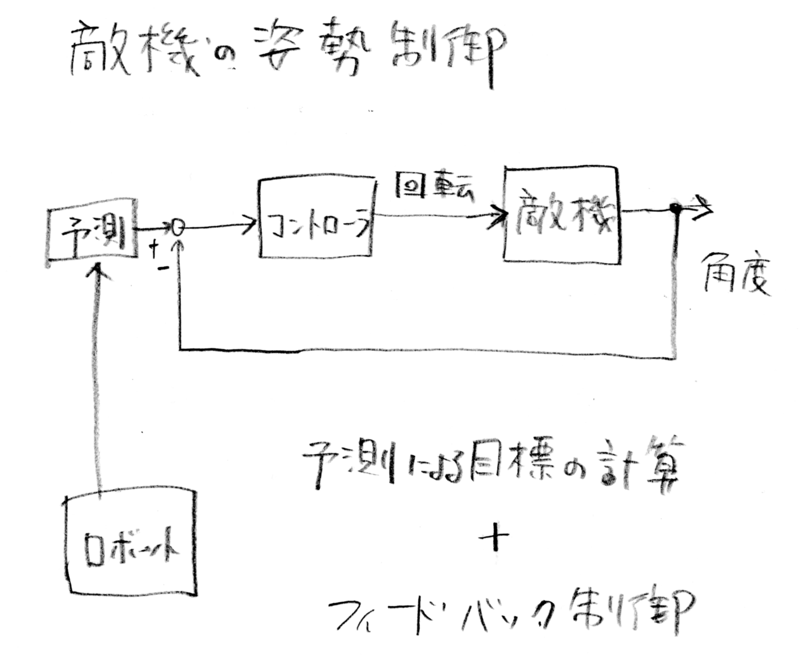

# 二輪駆動移動ロボットのシューティングゲームの開発

研究室に配属された 3 年生 5 名が週一回研究室に来て，演習課題としてPythonによるゲーム開発に取り組みました．二輪駆動ロボットが弾を発射し，敵機に命中させるゲームです．その開発の過程をまとめておきます．

## はじめに
プログラムはこのリポジトリからダウンロードできます．
pg26.pyというPythonプログラムを実行するとゲームが始まります．音声が発生しますので初めてのときはご注意ください．
Pygameというライブラリを使いますので，
 
pip install pygame
 
でインストールしてください．

## 目的

- Python によるプログラミングの基礎を学ぶ．
- 制御工学を応用してキャラクターの動作を制御する．
- 非ホロノミック拘束をもつ移動体の運動学を理解する．
- チームで協力して開発を進める．

## 二輪駆動移動ロボットを扱う理由

真横への速度成分をもつことができない二輪車をここでは移動ロボットと呼びます．この速度に関する拘束により，力学の勉強としては非ホロノミック拘束という学習課題が生まれ，ゲームのプレーにおいては操作に適度な難しさをもたらします．

## プログラミング環境

Pythonを使用し，Pygameというライブラリを用いてゲームを開発しました．Pygameは2Dゲームを作成するためのライブラリであり，画像ファイルをアニメーションで動かす，ゲームパッドを扱う，サウンドを再生するなどゲームに必要な機能を比較的容易にプログラミングできます．

プログラミングにおいてはAIには頼らず，最初はウィンドウに文字を表示させることからこつこつとPythonを学習しながら進めました．

## 制御工学の応用

プレーヤーが操作するロボットめがけて敵機は弾を発射します．敵機の命中率を上げるために，ロボットの位置と速度を推定し，その情報をもとに敵機の姿勢（回転角）を制御するプログラムを組み込みました．
 
 
## 二輪駆動ロボットの運動学に基づく動作アニメーション

二輪駆動ロボットの運動学に基づき，ロボットの前進，後退，旋回の動作をアニメーションで表現しました．速度と角速度をもとにロボットの位置と姿勢を更新し，その情報をもとに適切なアニメーションを表示します．

## 画像の生成

プログラミングではAIを使いませんでしたが，画像の生成にはAIを活用しました．敵機や背景画像はGeminiを用いて作成しました．

## サウンドの創作

ゲームの効果音やBGMはSteinberg社の音楽作成ソフトウエア Cubase を用いて作成しました．効果音のほか BGM は軽音サークルに所属する学生によるオリジナル曲です．

## チームでの開発

5 名の学生がチームを組み，役割分担を行いながら開発を進めました．プログラムの設計，コーディング，デバッグ，テストを分担し，定期的に進捗を共有しながら開発を進めました．
