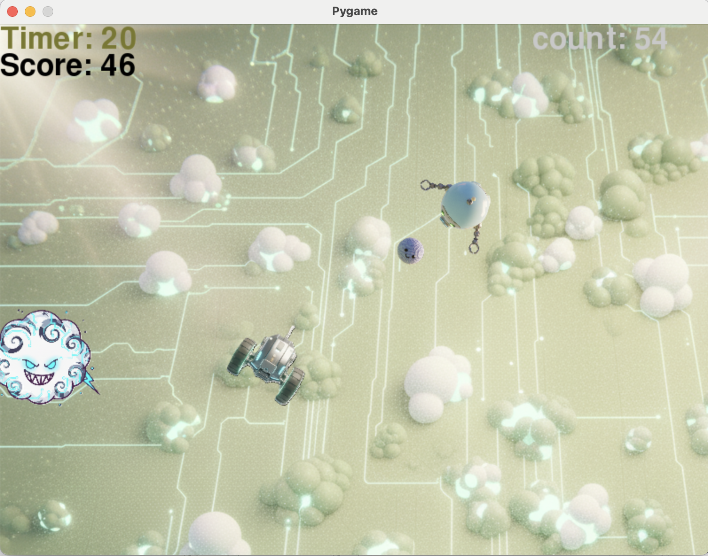
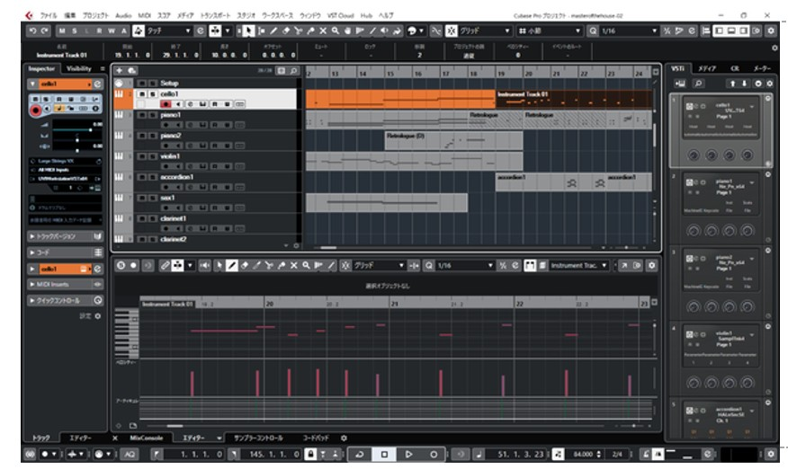

# 二輪駆動移動ロボットのシューティングゲームの開発

研究室に配属された 3 年生 5 名が週一回研究室に来て，演習課題としてPythonによるゲーム開発に取り組みました．二輪駆動ロボットが弾を発射し，敵機に命中させるゲームです．

 
## はじめに

### プログラムのダウンロード
プログラムはこのリポジトリからダウンロードできます．
Pythonプログラムのほか，画像や音声ファイルもあります．それらを同じフォルダに保存してください．

### ライブラリのインストール
Pygameというライブラリを使いますので，
 
pip install pygame
 
でインストールしてください．

### プログラムの実行
pg26.pyというPythonプログラムを実行するとゲームが始まります．音が発生しますので初めてのときはご注意ください．
過去の最高得点はscore01.txtに記録されます．
リセットしたい場合はscore01.txtをテキストエディタで開いて書き換えてください．

### ロボットの操作
キーボードの矢印キーで前進後退，左右の回転を操作します．
スペースキーを押すと弾を発射します．
ゲームパッドがあればそれでも操作可能です（後述「ゲームパッド対応」）．

## 目的

- Python によるプログラミングの基礎を学ぶ．
- 制御工学を応用してキャラクターの動作を制御する．
- 非ホロノミック拘束をもつ移動体の運動学を理解する．
- チームで協力して開発を進める．

## 二輪駆動移動ロボットを扱う理由

真横への速度成分をもつことができない二輪車をここでは移動ロボットと呼びます．この速度に関する拘束により，力学の勉強としては非ホロノミック拘束という学習課題が生まれ，ゲームのプレーにおいては操作に適度な難しさをもたらします．

## プログラミング環境

Pythonを使用し，Pygameというライブラリを用いてゲームを開発しました．Pygameは2Dゲームを作成するためのライブラリで，画像ファイルをアニメーションで動かす，ゲームパッドを扱う，サウンドを再生するなどゲームに必要な機能を比較的容易にプログラミングできます．

この演習でのプログラミングにおいては勉強優先のため AI には頼らず，第一回の授業ではPythonの基礎から始め，その後もこつこつとPythonとPygameの使い方を学習しながら進めました．

## 制御工学の応用

プレーヤーが操作するロボットめがけて敵機は弾を発射します．敵機による命中率を上げるために，ロボットの速度から未来の位置を推定し，その情報をもとに敵機の姿勢（回転角）を制御するプログラムを組み込みました．
 

## 二輪駆動ロボットの運動学に基づく動作アニメーション

二輪駆動ロボットの運動学に基づき，ロボットの前進，後退，旋回の動作をアニメーションで表現しました．速度と角速度をもとにロボットの位置と姿勢を更新し，その情報をもとに適切なアニメーションを表示します．

## 突如現れる障害物

単調になりがちなシューティングゲームに，あるタイミングで登場する障害物を導入しました．ロボットに接近して接触すると吸着してロボットを強制的に移動させます．
 

## ゲームパッド対応
pygameライブラリを使ってゲームパッドを導入しました．ロボットの移動と弾の発射はもちろん，他の機能も設定しました．

 
## 画像の生成

プログラミングではAIを使いませんでしたが，画像の生成にはAIを活用しました．敵機や背景画像はGeminiを用いて作成しました．
 
## サウンドの創作

ゲームの効果音やBGMはSteinberg社の音楽作成ソフトウエア Cubase を用いて作成しました．効果音のほか BGM は軽音サークルに所属する学生によるオリジナル曲です．
 

## チームでの開発
学生はみんなPython初心者でしたので，前半6週はPython全員が同じ課題（PythonとPygameの基礎）に取り組みました．
後半6週は役割分担（制御，障害物，ゲームパッド，画像，サウンド）を決めて分担作業し，最後に全体を結合して一つのプログラムにしました．

## 参考文献
「やさしいPython」高橋麻奈，SB Creative (2018) 
「Pythonでつくるゲーム開発入門講座」廣瀬豪，ソーテック（2019）
